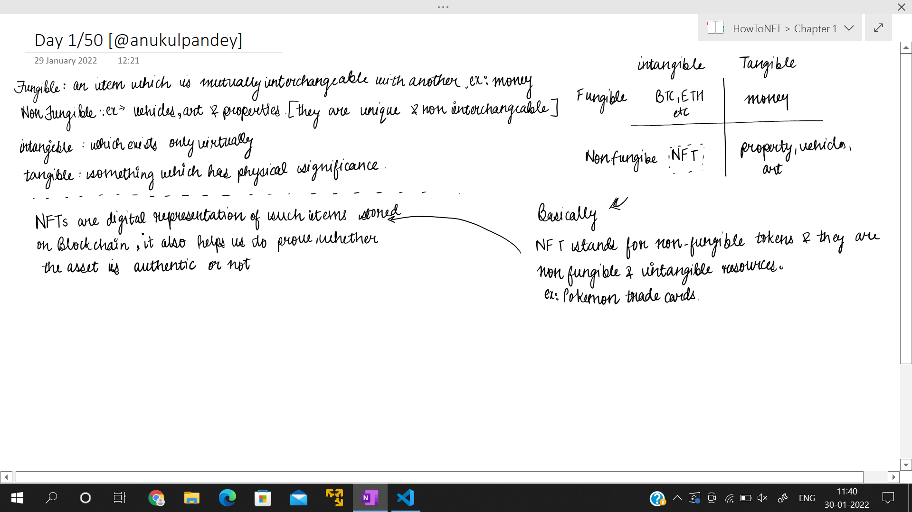
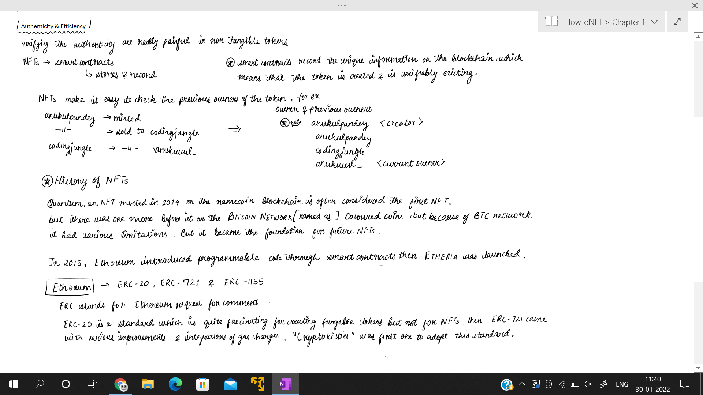
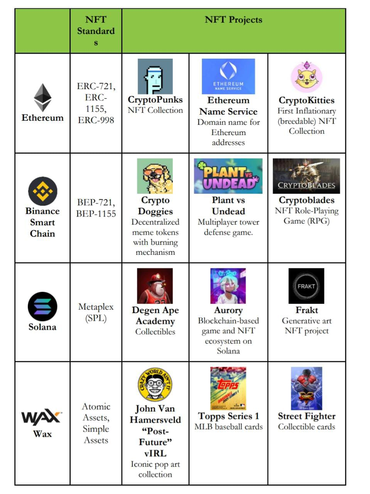

# 50DaysOfNFTs

Welcome to 50DaysOfNFTs , here I will post about NFTs from beginners level to an advanced level. The topics covered will be like:
- What is NFT?
- How is it made?
- History of NFTs
- How to create your own NFT?
- How to sell a NFT?
- etc
## Installation
```bash
apt install git -y
git clone https://github.com/anukulpandey/50DaysOfNFTs
cd 50DaysOfNFTs
```

After Installation Just click on the file you want to read & you it will be opened in OneNote.

All the notes are digitally prepared, at the moment I am not so comfortable with Tablet, but for sure you will see improvements in the Handwriting :)

Star this repository to support me :)

## Screenshots

### Day 1


### Day 2

#### Notes


#### Resource


## Authors

- [@anukulpandey](https://www.github.com/anukulpandey)

  